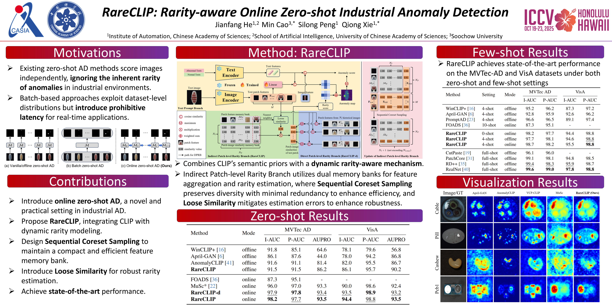
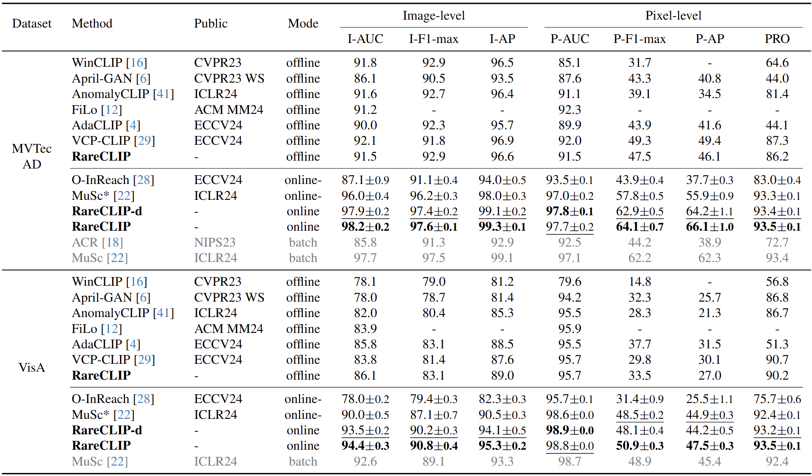

# [ICCV2025] RareCLIP: Rarity-aware Online Zero-shot Industrial Anomaly Detection ([Paper Link](https://openaccess.thecvf.com/content/ICCV2025/html/He_RareCLIP_Rarity-aware_Online_Zero-shot_Industrial_Anomaly_Detection_ICCV_2025_paper.html))

## Poster


## Abstract
Large vision-language models such as CLIP have made significant strides in zero-shot anomaly detection through prompt engineering.
However, most existing methods typically process each test image individually, ignoring the practical rarity of abnormal patches in real-world scenarios.
Although some batch-based approaches exploit the rarity by processing multiple samples concurrently, they generally introduce unacceptable latency for real-time applications.
To mitigate these limitations, we propose RareCLIP, a novel online zero-shot anomaly detection framework that enables sequential image processing in real-time without requiring prior knowledge of the target domain.
RareCLIP capitalizes on the zero-shot capabilities of CLIP and integrates a dynamic test-time rarity estimation mechanism.
A key innovation of our framework is the introduction of a prototype patch feature memory bank, which aggregates representative features from historical observations and continuously updates their corresponding rarity measures.
For each incoming image patch, RareCLIP computes a rarity score by aggregating the rarity measures of its nearest neighbors within the memory bank.
Moreover, we introduce a prototype sampling strategy based on dissimilarity to enhance computational efficiency, as well as a similarity calibration strategy to enhance the robustness of rarity estimation.
Extensive experiments demonstrate that RareCLIP attains state-of-the-art performance with 98.2\% image-level AUROC on MVTec AD and 94.4\% on VisA, while achieving a latency of 59.4 ms.

## Installation

Create a new conda environment and install required packages.

```shell
conda create -n RareCLIP python=3.10
conda activate RareCLIP
pip install -r requirements.txt
```
Experiments are conducted on NVIDIA GeForce RTX 3090 (24GB). Same GPU and package version are recommended.
  
## Dataset Preparation 
### MVTec AD
Download and extract [MVTec AD](https://www.mvtec.com/company/research/datasets/mvtec-ad) into `../dataset/mvtec`.
```
data
├── mvtec
    ├── bottle
        ├── train
            ├── good
                ├── 000.png
        ├── test
            ├── good
                ├── 000.png
            ├── anomaly1
                ├── 000.png
        ├── ground_truth
            ├── anomaly1
                ├── 000.png
    ├── cable
    ├── capsule
    ├── ....
```

### VisA
Download and extract [VisA](https://amazon-visual-anomaly.s3.us-west-2.amazonaws.com/VisA_20220922.tar) into `../dataset/visa`.
```
data
├── visa
    ├── candle
        ├── Data
            ├── Images
                ├── Anomaly
                    ├── 000.JPG
                ├── Normal
                    ├── 0000.JPG
            ├── Masks
                ├── Anomaly
                    ├── 000.png
    ├── capsules
    ├── cashew
    ├── ...
    ├── split_csv
        ├── 1cls.csv
```


## Test
Set parameters in `test.sh`.
- `test`: name of the test dataset, optional: mvtec, visa
- `test_set_path`: the path to the test dataset
- `save_path`: the path to save log
- `seed`: the random seed
- `load_path`: the path to load TPB weight (use default provided weight or retrain yourself)

Then run the following command:
  ```shell
  sh test.sh
  ```

## Train
Train on MVTec AD:
  ```shell
  python train.py --train mvtec --train_set_path ../dataset/mvtec --save_path ./mvtec_pretrained
  ```
Train on VisA:
  ```shell
  python train.py --train visa --train_set_path ../dataset/visa --save_path ./visa_pretrained
  ```

## Results
Comparison of image-level and pixel-level zero-shot anomaly detection on the MVTec AD and VisA datasets.


## Acknowledgements
We appreciate the inspiration provided by [APRIL-GAN](https://github.com/ByChelsea/VAND-APRIL-GAN) and [MuSc](https://github.com/xrli-U/MuSc) for our work.

## Citation
If our work is helpful for your research, please consider citing:
```
@inproceedings{he2025RareCLIP,
  title={RareCLIP: Rarity-aware Online Zero-shot Industrial Anomaly Detection},
  author={He, Jianfang and Cao, Min and Peng, Silong and Xie, Qiong},
  booktitle={Proceedings of the IEEE/CVF International Conference on Computer Vision (ICCV)},
  pages={24478-24487},
  year={2025}
}
```